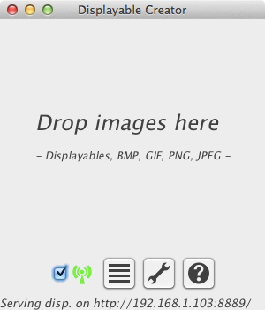
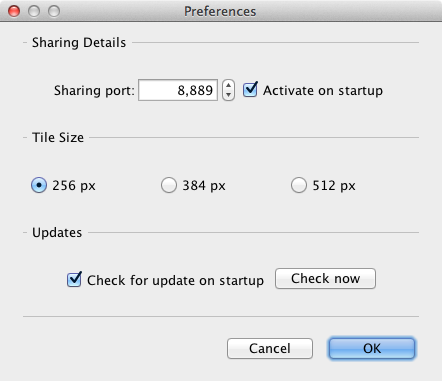
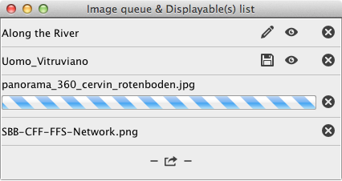
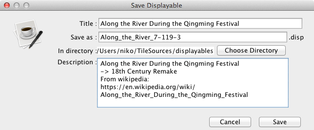

# Displayable Creator Help

## Principle

The aim of the Displayable creator is to create Displayable and to
allow you to open and view Displayables. A Displayable is created from
a usually big image.

Once the Displayable Creator is launched, just drop images on the main
window to create Displayables, or drop Displayables to view them.

## Main Window

The main window give access to all the functionality of the app. 

Dropping images on the central area will queue them to be transformed
into Displayables. Currently supported format are BMP, PNG, GIF and
JPEG (except for jpegs with CMYK color profiles). Size was tested up to 466 Megapixels
(21600x21600).

Dropping Displayables on the central area will add them to the list of
visible Displayables, wher e you can click on the eye icon to view
them.

- the checkbox enable or disable sharing of Displayables over the
  network (the status is indicated by the icon next to it).
- the button with the list icon gives access to the list of Displayables and images
  (queued for transformation into Displayables).
- the button with the sliders icon gives access to the preferences for the app.
- the button with the '?' icon gives access to this very document.

## Preferences

- _Sharing port_: the network port on your machine from which the
  Displayable Creator will serve the Displayable to your
  Displayator-running iOS devices. This port need to be open in your
  firewall.
- _Activate on startup_: when ticked, the Displayable creator will
  start the network sharing functionality when launching.
- _Tile Size_: A Displayable stores a copy of the original image cut
  in tiles that can be quickly accessed. This allow you to choose the
  tile size. Bigger tiles means less tiles to show. However, bigger
  tiles might take more time to load on older device. Tooltips
  indicate suggested usage for each tile size.
- _Check for update on startup_: as it says :-).
- _Check now_: will immediately check for update. Also, if you
  previously clicked on "ignore [version]", that version will no
  longer be ignored (until ignored again).

## Displayable & Image List

This list contains the images queued for transformation into
Displayable, and the Displayables ready for sharing over the local
network. Sharing is enabled/disabled on the main screen.

- The _floppy-disk icon_ marks that the Displayable is unsaved,
meaning that it will be destroyed when you quit the app. Click on it
to view the save dialog (see bellow).
- The _pencil icon_ indicate the Displayable has already been
  saved. Clicking on it will popup the save/edit dialog (see bellow).
- Clicking on the _eye icon_ will activate the Displayable viewer
  window, loading it with the selected Displayable.
- Clicking on the _x icon_ allows you to remove the Displayable or
  queued (or processing) image from the list. If the Displayable is
  unsaved, removing it from the list will remove it from its temporary
  place on your computer.

## The Edit / Save dialog

The Edit/Save dialog allows you to change the title of the
Displayable, its file name, and you can add a description.

- The _title_ is the name of the Displayable as it will appear in the
  Displayator app on your iOS device.
- The _save as_ field contains the file name of the Displayable,
  without the file extension.
  your Displayable in.
- The _in directory_ field contains the directory you want to save
- The _description_ will appear on the download screen of the
  Displayable app, on top of a miniature of the image.

## Viewing Displayables

When you click on the _eye_ icon in the Displayable list, the viewer
will appear with the selected Displayable. Clicking on the
looking-glasses with + and - will zoom and de-zoom the Displayable.

You can move the view around by dragging the image.

## Sharing Displayables over the local network

If you have any Displayable loaded in the app, and enable the checkbox
on the main screen of the app, the Displayable will be made available
over the local network. The icon next to the checkbox indicate the
status of the sharing:

- Green broadcast tower for activated.
- Yellow broadcast tower for deactivated.
- Gray hourglass while changing status.

To download Displayables Connect your iOS device to the same network,
start the Displayator app and tap on "Download Displayables". The app
should automatically find this Displayable Creator and fetch the list
of Displayable ready for download. Newly created Displayables might
take a few seconds after being created before they appear in the list
of available shared displayables.

Should the Displayator app fail to find the list of shared
Displayables, open Safari on your iOS device and type in the address
that appear at the bottom of the Displayable Creator application. The
page at that address will contain links to either open the list or
start downloading individual Displayables in the Displayator app.

## License and Third Party Components

Clickable links will be available at http://www.displayator.com/DisplayableCreator/

This app is licensed under the GPL v3
(http://www.gnu.org/licenses/gpl.html). The source code is available
on github at _https://github.com/nicolasH/DisplayableCreator_.

It depends on the following libraries, which have their own licenses:

- Jetty, a web server and servlet container. (http://www.eclipse.org/jetty/)
- SQLite-JDBC, a pure java driver for SQLite. (https://bitbucket.org/xerial/sqlite-jdbc)
- JmDNS, a Bonjour/multicast DNS java implementation. (http://jmdns.sourceforge.net/)
- Maven-Artifact, a library used to compare the version numbers. (http://maven.apache.org/)
- Google-gson, a Java library to convert JSON to Java objects and vice-versa. (https://code.google.com/p/google-gson/)

It also uses icons from multiple icon sets, packaged into a single font file using http://www.icomoon.io. Here is a list of the used icons and their origin.

- IcoMoon: _hourglass_, _edit_, _delete_, _expand_ & _contract_.
- Entypo: _export_, _dash_ & _help_.
- WPZOOM: _eye_, _zoom in_ & _zoom out_.
- Silkcons: _broadcast_ & _list_.
- Broccolidry: _save_ & _warning_.
- Iconic: _preferences_.

Here are the icon sets homepages and licenses.

Iconic -- http://somerandomdude.com/work/iconic/   
CC BY-SA 3.0 -- http://creativecommons.org/licenses/by-sa/3.0/us/

Entypo -- http://www.entypo.com/   
CC BY-SA 3.0 -- http://creativecommons.org/licenses/by-sa/3.0/

Broccolidry -- http://dribbble.com/shots/587469-Free-16px-Broccolidryiconsaniconsetitisfullof-icons   
Arbitrary -- http://licence.visualidiot.com/

WPZOOM Developer Icon Set -- http://www.wpzoom.com/wpzoom/new-freebie-wpzoom-developer-icon-set-154-free-icons/   
CC BY-SA 3.0 -- http://creativecommons.org/licenses/by-sa/3.0/

Silkcons -- http://dribbble.com/shots/632219-Silkcons-You-can-t-do-with-just-one-icon-set   
CC0 -- http://creativecommons.org/publicdomain/zero/1.0/

IcoMoon - Free -- http://keyamoon.com/icomoon/   
CC BY 3.0 -- http://creativecommons.org/licenses/by/3.0/

